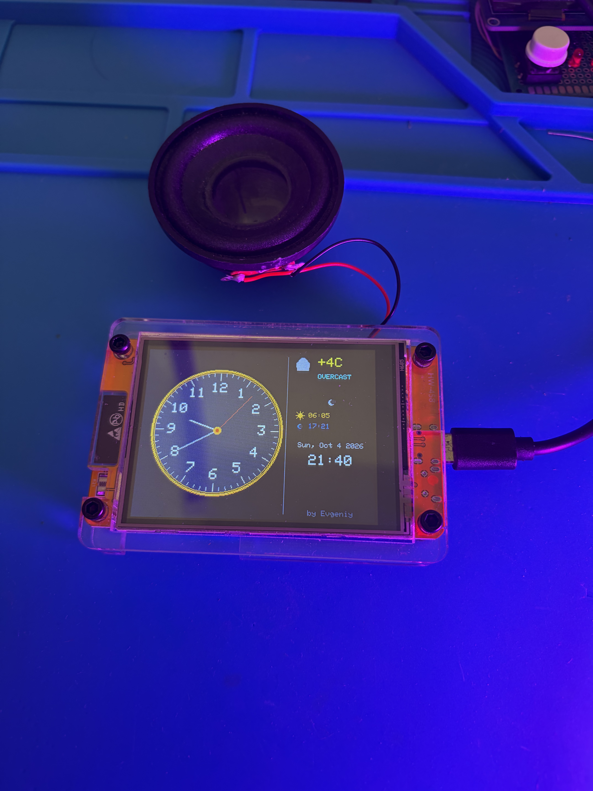

# ESP32 CYD Clock

Умные часы на ESP32 с аналоговым циферблатом, погодой, восходом/закатом и автояркостью.



## Особенности

- Аналоговый циферблат с плавным движением стрелок.
- Погода через API `wttr.in` (без API-ключей).
- Расчёт восхода/заката по формулам NOAA прямо на ESP32.
- Автояркость по датчику освещённости (LDR на GPIO 34).
- Поддержка портретной и ландшафтной ориентации (переключение долгим нажатием).
- Ручная отрисовка иконок погоды примитивами (без картинок).

## Железо

- Плата: ESP32-2432S028 (Cheap Yellow Display).
- Дисплей: TFT ILI9341 2.8" (через библиотеку `TFT_eSPI`).
- Датчик: фоторезистор (LDR) + резистор 10 кОм на GPIO 34.

## Установка

1. Установите библиотеку `TFT_eSPI` в Arduino IDE.
2. Настройте `User_Setup.h` под плату ESP32-2432S028.
3. В файле `src/main.cpp` укажите свои данные Wi-Fi:

```cpp
const char* ssid     = "ВАШ_SSID";
const char* password = "ВАШ_ПАРОЛЬ";
```

4. При необходимости поправьте координаты и часовой пояс:

```cpp
const float LAT = 60.93;
const float LON = 76.28;
const int   TZ_OFFSET = 5;
```

5. Загрузите скетч на ESP32.

## Управление

- **Короткое нажатие** — переключение режимов яркости (авто / тускло / средне / ярко).
- **Длинное нажатие** — поворот экрана (портрет / ландшафт).

## Лицензия

MIT
